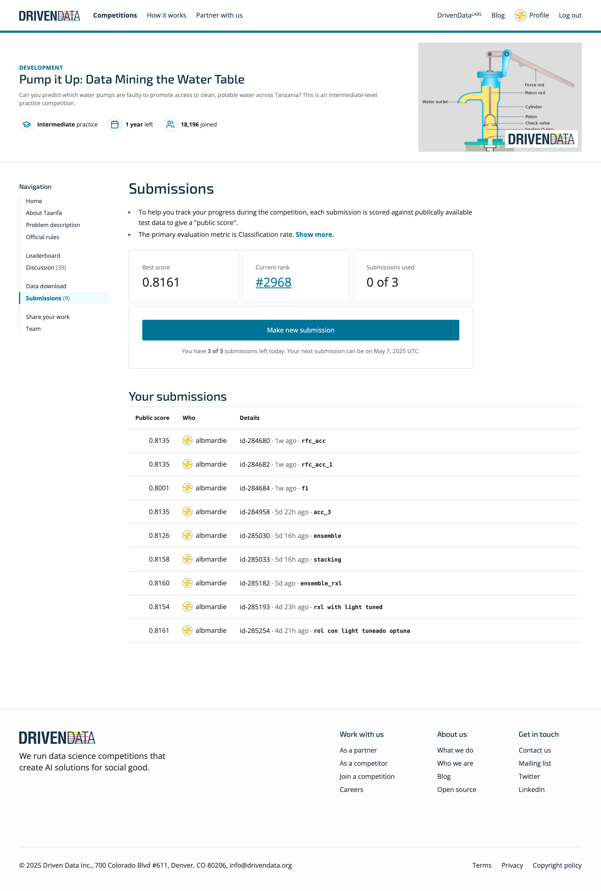

# 💧 Pump It Up: Data Mining the Water Table

Este proyecto forma parte de la competición [**Pump It Up**](https://www.drivendata.org/competitions/7/pump-it-up-data-mining-the-water-table/page/25/) organizada por DrivenData. El objetivo es predecir el estado funcional de las bombas de agua en Tanzania utilizando datos estructurales, geográficos y operativos.

---

## 🧠 Objetivo del proyecto

Clasificar cada bomba como:
- `functional`
- `non functional`
- `functional needs repair`

Se trata de un problema de clasificación multiclase con fuerte desbalanceo y muchas variables categóricas.

---

## 📂 Archivos incluidos

- `Tarea_final_ML.ipynb`: Notebook principal con todo el análisis, limpieza de datos y modelos.
- `output.html`: Informe automático generado con YData Profiling.
- `score.png`: Captura de pantalla con la puntuación obtenida en la plataforma de DrivenData.

---

## 🛠 Herramientas y técnicas

- Exploración de datos y visualización con `pandas`, `matplotlib` y `seaborn`
- Generación automática de informes de perfilado con `ydata-profiling`
- Limpieza y preprocesamiento de datos (manejo de nulos, codificación de variables categóricas)
- Ingeniería de características
- División de datos con `train_test_split` y validación estratificada
- Modelado con clasificadores avanzados:
  - `RandomForestClassifier`
  - `XGBClassifier` (XGBoost)
  - `HistGradientBoostingClassifier`
- Optimización de hiperparámetros con:
  - `GridSearchCV` (búsqueda exhaustiva)
  - `Optuna` (búsqueda bayesiana)
- Comparación de modelos usando curvas ROC, AUC, F1-score, precisión y matriz de confusión
- Construcción de un modelo ensamblado usando **StackingClassifier** (ensamble de modelos base con meta-modelo)

---

## 📈 Resultado

Captura de pantalla del leaderboard de DrivenData con la puntuación final obtenida.

---

## 📝 Notas

Este es uno de los proyectos incluidos en mi repositorio principal [**Cuaderno del Argonauta**](../), que recopila distintos trabajos prácticos de Machine Learning.
